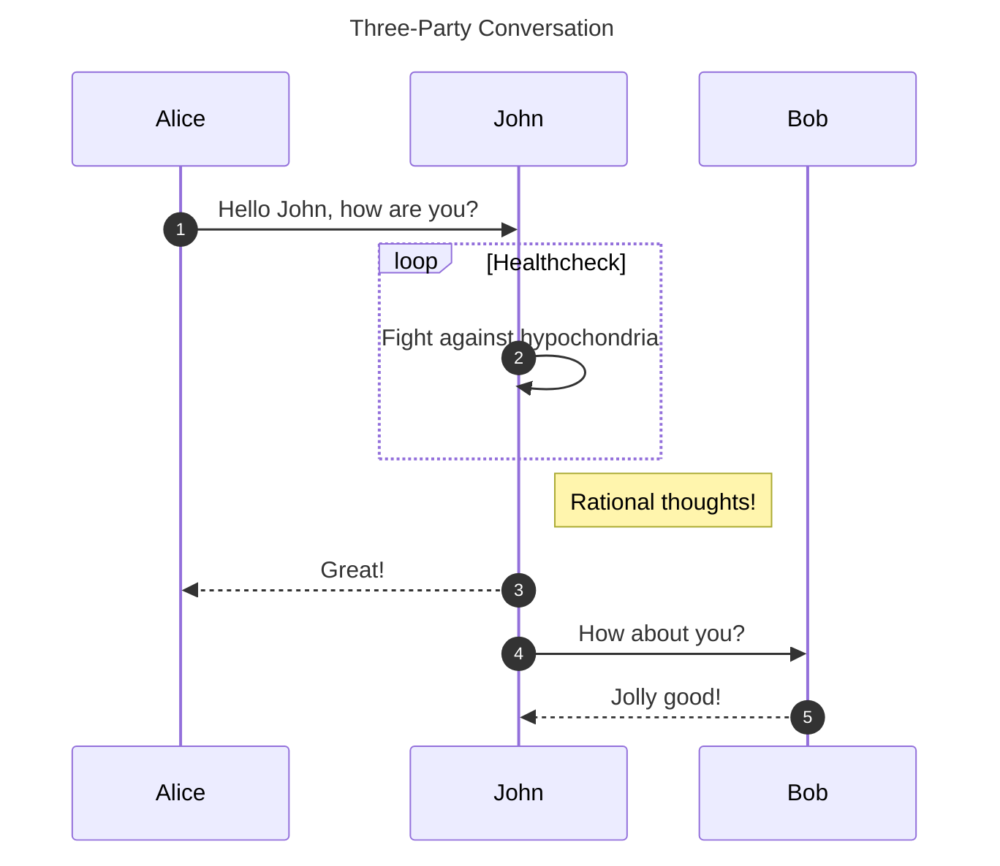
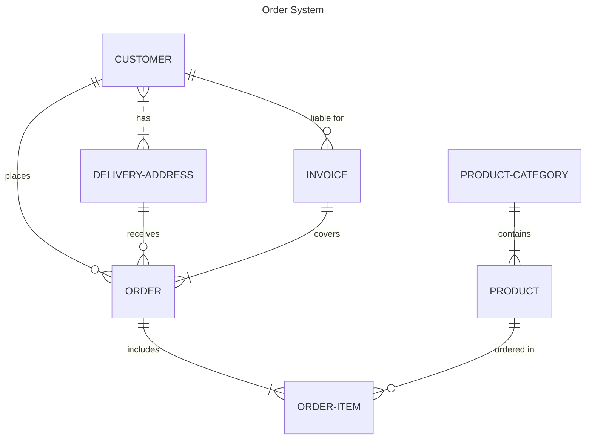
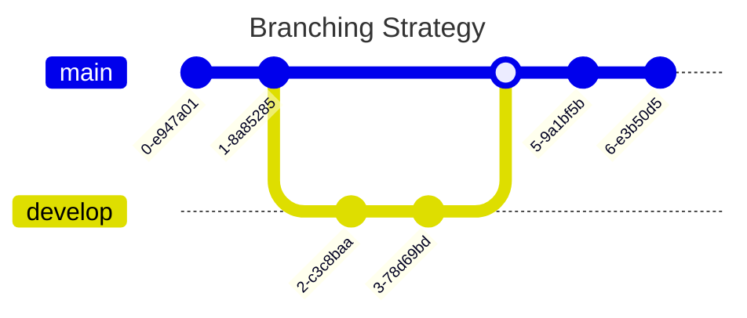
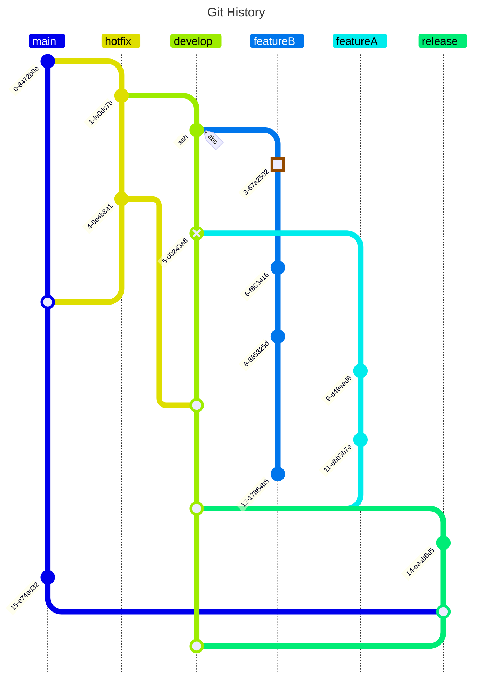
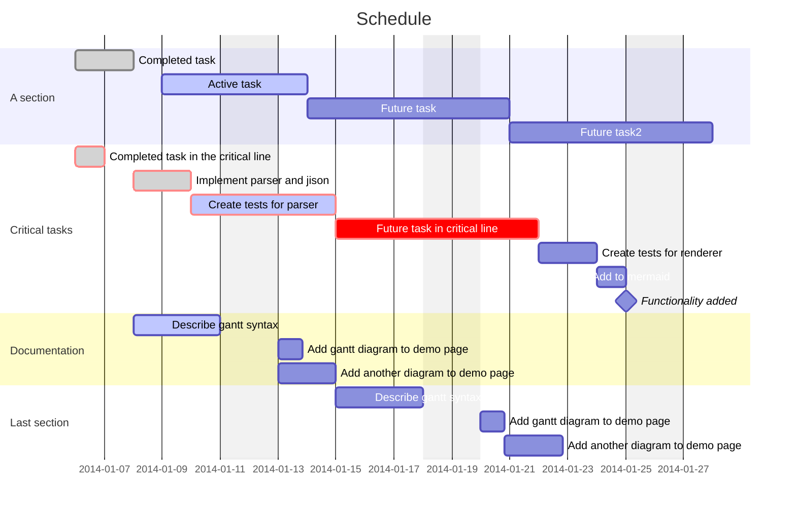
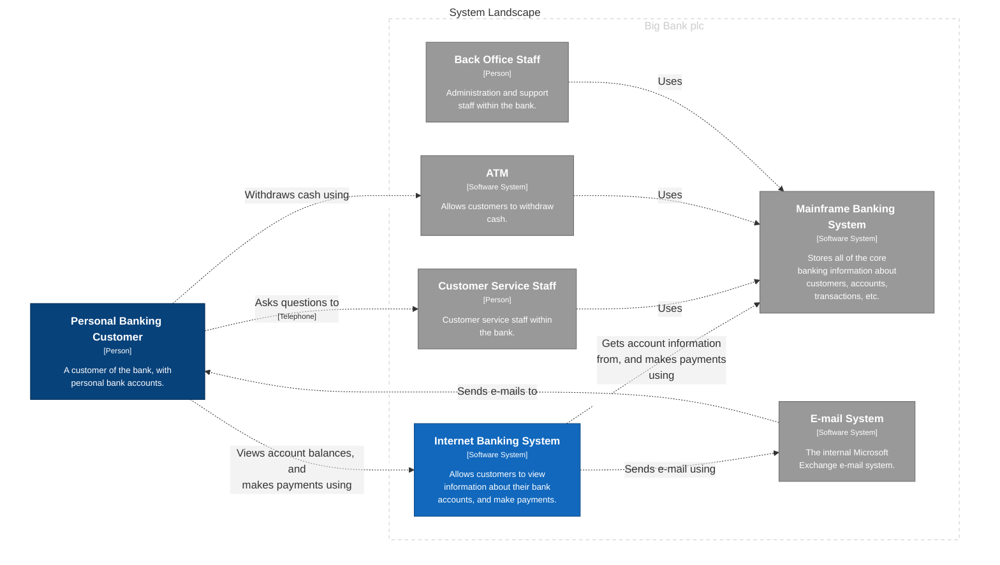
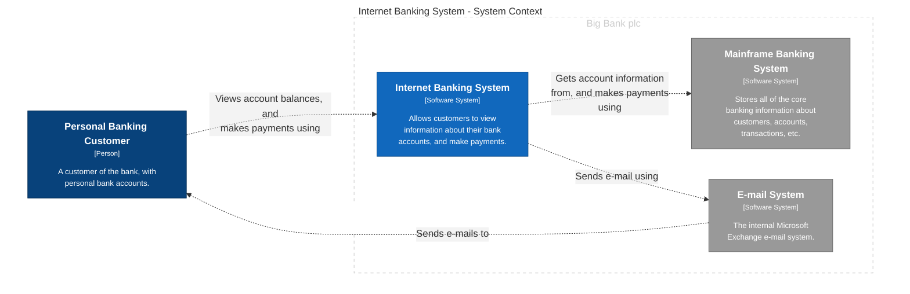
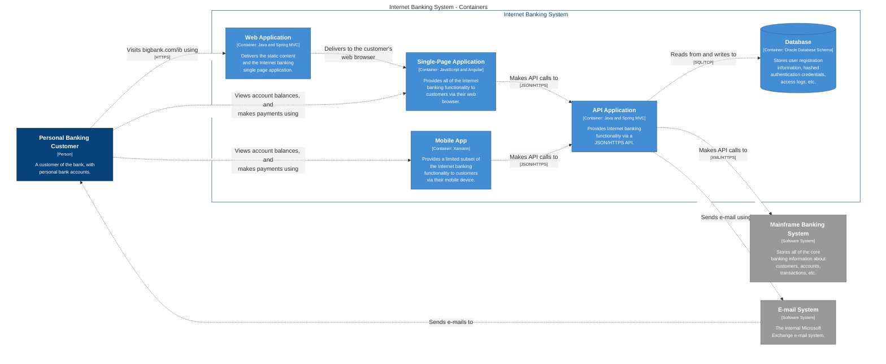
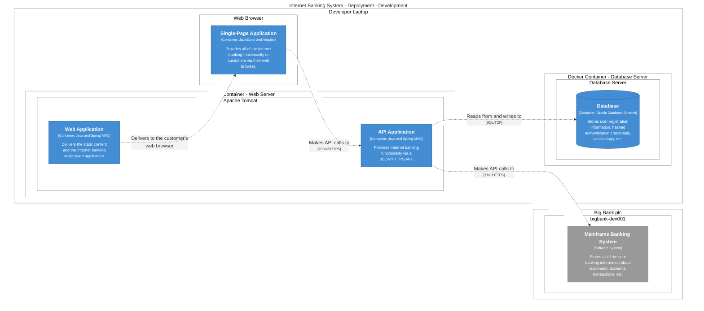
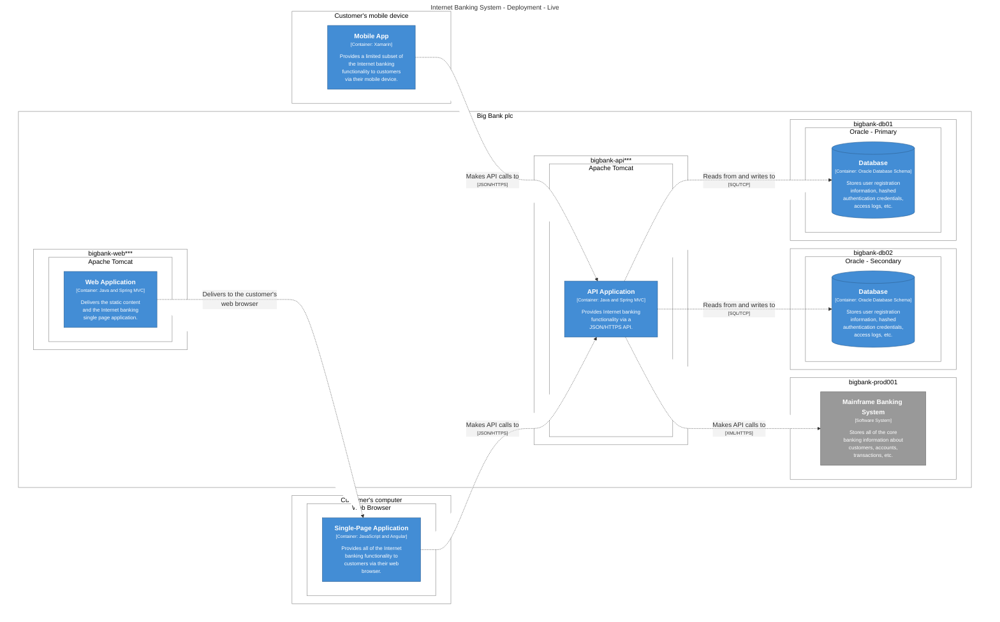

# Mermaid Diagrams

Examples of Mermaid diagrams.

## Sequence Diagrams

```mermaid
---
title: Three-Party Conversation
---
sequenceDiagram
    autonumber
    Alice->>John: Hello John, how are you?
    loop Healthcheck
      John->>John: Fight against hypochondria
    end
    Note right of John: Rational thoughts!
    John-->>Alice: Great!
    John->>Bob: How about you?
    Bob-->>John: Jolly good!
```

## ER Diagrams

```mermaid
---
title: Order System
---
erDiagram
  CUSTOMER }|..|{ DELIVERY-ADDRESS : has
  CUSTOMER ||--o{ ORDER : places
  CUSTOMER ||--o{ INVOICE : "liable for"
  DELIVERY-ADDRESS ||--o{ ORDER : receives
  INVOICE ||--|{ ORDER : covers
  ORDER ||--|{ ORDER-ITEM : includes
  PRODUCT-CATEGORY ||--|{ PRODUCT : contains
  PRODUCT ||--o{ ORDER-ITEM : "ordered in"
```

## Gitgraph Diagrams

```mermaid
---
title: Branching Strategy
---
gitGraph:
  commit
  commit
  branch develop
  checkout develop
  commit
  commit
  checkout main
  merge develop
  commit
  commit
```

```mermaid
---
title: Git History
---
gitGraph TB:
  commit
  branch hotfix
  checkout hotfix
  commit
  branch develop
  checkout develop
  commit id:"ash" tag:"abc"
  branch featureB
  checkout featureB
  commit type:HIGHLIGHT
  checkout main
  checkout hotfix
  commit type:NORMAL
  checkout develop
  commit type:REVERSE
  checkout featureB
  commit
  checkout main
  merge hotfix
  checkout featureB
  commit
  checkout develop
  branch featureA
  commit
  checkout develop
  merge hotfix
  checkout featureA
  commit
  checkout featureB
  commit
  checkout develop
  merge featureA
  branch release
  checkout release
  commit
  checkout main
  commit
  checkout release
  merge main
  checkout develop
  merge release
```

## Gantt Diagrams

```mermaid
gantt
  dateFormat  YYYY-MM-DD
  title       Schedule
  excludes    weekends
  %% (`excludes` accepts specific dates in YYYY-MM-DD format, days of the week ("sunday") or "weekends", but not the word "weekdays".)

  section A section
  Completed task            :done,    des1, 2014-01-06,2014-01-08
  Active task               :active,  des2, 2014-01-09, 3d
  Future task               :         des3, after des2, 5d
  Future task2              :         des4, after des3, 5d

  section Critical tasks
  Completed task in the critical line :crit, done, 2014-01-06,24h
  Implement parser and jison          :crit, done, after des1, 2d
  Create tests for parser             :crit, active, 3d
  Future task in critical line        :crit, 5d
  Create tests for renderer           :2d
  Add to mermaid                      :1d
  Functionality added                 :milestone, 2014-01-25, 0d

  section Documentation
  Describe gantt syntax               :active, a1, after des1, 3d
  Add gantt diagram to demo page      :after a1  , 20h
  Add another diagram to demo page    :doc1, after a1  , 48h

  section Last section
  Describe gantt syntax               :after doc1, 3d
  Add gantt diagram to demo page      :20h
  Add another diagram to demo page    :48h
```

## C4 Diagrams

```mermaid
graph TB
  linkStyle default fill:#ffffff

  subgraph diagram ["System Landscape"]
    style diagram fill:#ffffff,stroke:#ffffff

    subgraph group1 [Big Bank plc]
      style group1 fill:#ffffff,stroke:#cccccc,color:#cccccc,stroke-dasharray:5

      2["<div style='font-weight: bold'>Customer Service Staff</div><div style='font-size: 70%; margin-top: 0px'>[Person]</div><div style='font-size: 80%; margin-top:10px'>Customer service staff within<br />the bank.</div>"]
      style 2 fill:#999999,stroke:#6b6b6b,color:#ffffff
      3["<div style='font-weight: bold'>Back Office Staff</div><div style='font-size: 70%; margin-top: 0px'>[Person]</div><div style='font-size: 80%; margin-top:10px'>Administration and support<br />staff within the bank.</div>"]
      style 3 fill:#999999,stroke:#6b6b6b,color:#ffffff
      4["<div style='font-weight: bold'>Mainframe Banking System</div><div style='font-size: 70%; margin-top: 0px'>[Software System]</div><div style='font-size: 80%; margin-top:10px'>Stores all of the core<br />banking information about<br />customers, accounts,<br />transactions, etc.</div>"]
      style 4 fill:#999999,stroke:#6b6b6b,color:#ffffff
      5["<div style='font-weight: bold'>E-mail System</div><div style='font-size: 70%; margin-top: 0px'>[Software System]</div><div style='font-size: 80%; margin-top:10px'>The internal Microsoft<br />Exchange e-mail system.</div>"]
      style 5 fill:#999999,stroke:#6b6b6b,color:#ffffff
      6["<div style='font-weight: bold'>ATM</div><div style='font-size: 70%; margin-top: 0px'>[Software System]</div><div style='font-size: 80%; margin-top:10px'>Allows customers to withdraw<br />cash.</div>"]
      style 6 fill:#999999,stroke:#6b6b6b,color:#ffffff
      7["<div style='font-weight: bold'>Internet Banking System</div><div style='font-size: 70%; margin-top: 0px'>[Software System]</div><div style='font-size: 80%; margin-top:10px'>Allows customers to view<br />information about their bank<br />accounts, and make payments.</div>"]
      style 7 fill:#1168bd,stroke:#0b4884,color:#ffffff
    end

    1["<div style='font-weight: bold'>Personal Banking Customer</div><div style='font-size: 70%; margin-top: 0px'>[Person]</div><div style='font-size: 80%; margin-top:10px'>A customer of the bank, with<br />personal bank accounts.</div>"]
    style 1 fill:#08427b,stroke:#052e56,color:#ffffff

    1-. "<div>Views account balances, and<br />makes payments using</div><div style='font-size: 70%'></div>" .->7
    7-. "<div>Gets account information<br />from, and makes payments<br />using</div><div style='font-size: 70%'></div>" .->4
    7-. "<div>Sends e-mail using</div><div style='font-size: 70%'></div>" .->5
    5-. "<div>Sends e-mails to</div><div style='font-size: 70%'></div>" .->1
    1-. "<div>Asks questions to</div><div style='font-size: 70%'>[Telephone]</div>" .->2
    2-. "<div>Uses</div><div style='font-size: 70%'></div>" .->4
    1-. "<div>Withdraws cash using</div><div style='font-size: 70%'></div>" .->6
    6-. "<div>Uses</div><div style='font-size: 70%'></div>" .->4
    3-. "<div>Uses</div><div style='font-size: 70%'></div>" .->4
  end
```

```mermaid
graph TB
  linkStyle default fill:#ffffff

  subgraph diagram ["Internet Banking System - System Context"]
    style diagram fill:#ffffff,stroke:#ffffff

    subgraph group1 [Big Bank plc]
      style group1 fill:#ffffff,stroke:#cccccc,color:#cccccc,stroke-dasharray:5

      4["<div style='font-weight: bold'>Mainframe Banking System</div><div style='font-size: 70%; margin-top: 0px'>[Software System]</div><div style='font-size: 80%; margin-top:10px'>Stores all of the core<br />banking information about<br />customers, accounts,<br />transactions, etc.</div>"]
      style 4 fill:#999999,stroke:#6b6b6b,color:#ffffff
      5["<div style='font-weight: bold'>E-mail System</div><div style='font-size: 70%; margin-top: 0px'>[Software System]</div><div style='font-size: 80%; margin-top:10px'>The internal Microsoft<br />Exchange e-mail system.</div>"]
      style 5 fill:#999999,stroke:#6b6b6b,color:#ffffff
      7["<div style='font-weight: bold'>Internet Banking System</div><div style='font-size: 70%; margin-top: 0px'>[Software System]</div><div style='font-size: 80%; margin-top:10px'>Allows customers to view<br />information about their bank<br />accounts, and make payments.</div>"]
      style 7 fill:#1168bd,stroke:#0b4884,color:#ffffff
    end

    1["<div style='font-weight: bold'>Personal Banking Customer</div><div style='font-size: 70%; margin-top: 0px'>[Person]</div><div style='font-size: 80%; margin-top:10px'>A customer of the bank, with<br />personal bank accounts.</div>"]
    style 1 fill:#08427b,stroke:#052e56,color:#ffffff

    1-. "<div>Views account balances, and<br />makes payments using</div><div style='font-size: 70%'></div>" .->7
    7-. "<div>Gets account information<br />from, and makes payments<br />using</div><div style='font-size: 70%'></div>" .->4
    7-. "<div>Sends e-mail using</div><div style='font-size: 70%'></div>" .->5
    5-. "<div>Sends e-mails to</div><div style='font-size: 70%'></div>" .->1
  end
```

```mermaid
graph TB
  linkStyle default fill:#ffffff

  subgraph diagram ["Internet Banking System - Containers"]
    style diagram fill:#ffffff,stroke:#ffffff

    1["<div style='font-weight: bold'>Personal Banking Customer</div><div style='font-size: 70%; margin-top: 0px'>[Person]</div><div style='font-size: 80%; margin-top:10px'>A customer of the bank, with<br />personal bank accounts.</div>"]
    style 1 fill:#08427b,stroke:#052e56,color:#ffffff
    4["<div style='font-weight: bold'>Mainframe Banking System</div><div style='font-size: 70%; margin-top: 0px'>[Software System]</div><div style='font-size: 80%; margin-top:10px'>Stores all of the core<br />banking information about<br />customers, accounts,<br />transactions, etc.</div>"]
    style 4 fill:#999999,stroke:#6b6b6b,color:#ffffff
    5["<div style='font-weight: bold'>E-mail System</div><div style='font-size: 70%; margin-top: 0px'>[Software System]</div><div style='font-size: 80%; margin-top:10px'>The internal Microsoft<br />Exchange e-mail system.</div>"]
    style 5 fill:#999999,stroke:#6b6b6b,color:#ffffff

    subgraph 7 [Internet Banking System]
      style 7 fill:#ffffff,stroke:#0b4884,color:#0b4884

      10["<div style='font-weight: bold'>Web Application</div><div style='font-size: 70%; margin-top: 0px'>[Container: Java and Spring MVC]</div><div style='font-size: 80%; margin-top:10px'>Delivers the static content<br />and the Internet banking<br />single page application.</div>"]
      style 10 fill:#438dd5,stroke:#2e6295,color:#ffffff
      11["<div style='font-weight: bold'>API Application</div><div style='font-size: 70%; margin-top: 0px'>[Container: Java and Spring MVC]</div><div style='font-size: 80%; margin-top:10px'>Provides Internet banking<br />functionality via a<br />JSON/HTTPS API.</div>"]
      style 11 fill:#438dd5,stroke:#2e6295,color:#ffffff
      18[("<div style='font-weight: bold'>Database</div><div style='font-size: 70%; margin-top: 0px'>[Container: Oracle Database Schema]</div><div style='font-size: 80%; margin-top:10px'>Stores user registration<br />information, hashed<br />authentication credentials,<br />access logs, etc.</div>")]
      style 18 fill:#438dd5,stroke:#2e6295,color:#ffffff
      8["<div style='font-weight: bold'>Single-Page Application</div><div style='font-size: 70%; margin-top: 0px'>[Container: JavaScript and Angular]</div><div style='font-size: 80%; margin-top:10px'>Provides all of the Internet<br />banking functionality to<br />customers via their web<br />browser.</div>"]
      style 8 fill:#438dd5,stroke:#2e6295,color:#ffffff
      9["<div style='font-weight: bold'>Mobile App</div><div style='font-size: 70%; margin-top: 0px'>[Container: Xamarin]</div><div style='font-size: 80%; margin-top:10px'>Provides a limited subset of<br />the Internet banking<br />functionality to customers<br />via their mobile device.</div>"]
      style 9 fill:#438dd5,stroke:#2e6295,color:#ffffff
    end

    5-. "<div>Sends e-mails to</div><div style='font-size: 70%'></div>" .->1
    1-. "<div>Visits bigbank.com/ib using</div><div style='font-size: 70%'>[HTTPS]</div>" .->10
    1-. "<div>Views account balances, and<br />makes payments using</div><div style='font-size: 70%'></div>" .->8
    1-. "<div>Views account balances, and<br />makes payments using</div><div style='font-size: 70%'></div>" .->9
    10-. "<div>Delivers to the customer's<br />web browser</div><div style='font-size: 70%'></div>" .->8
    8-. "<div>Makes API calls to</div><div style='font-size: 70%'>[JSON/HTTPS]</div>" .->11
    9-. "<div>Makes API calls to</div><div style='font-size: 70%'>[JSON/HTTPS]</div>" .->11
    11-. "<div>Reads from and writes to</div><div style='font-size: 70%'>[SQL/TCP]</div>" .->18
    11-. "<div>Makes API calls to</div><div style='font-size: 70%'>[XML/HTTPS]</div>" .->4
    11-. "<div>Sends e-mail using</div><div style='font-size: 70%'></div>" .->5
  end
```

```mermaid
graph TB
  linkStyle default fill:#ffffff

  subgraph diagram ["Internet Banking System - API Application - Components"]
    style diagram fill:#ffffff,stroke:#ffffff

    4["<div style='font-weight: bold'>Mainframe Banking System</div><div style='font-size: 70%; margin-top: 0px'>[Software System]</div><div style='font-size: 80%; margin-top:10px'>Stores all of the core<br />banking information about<br />customers, accounts,<br />transactions, etc.</div>"]
    style 4 fill:#999999,stroke:#6b6b6b,color:#ffffff
    5["<div style='font-weight: bold'>E-mail System</div><div style='font-size: 70%; margin-top: 0px'>[Software System]</div><div style='font-size: 80%; margin-top:10px'>The internal Microsoft<br />Exchange e-mail system.</div>"]
    style 5 fill:#999999,stroke:#6b6b6b,color:#ffffff
    18[("<div style='font-weight: bold'>Database</div><div style='font-size: 70%; margin-top: 0px'>[Container: Oracle Database Schema]</div><div style='font-size: 80%; margin-top:10px'>Stores user registration<br />information, hashed<br />authentication credentials,<br />access logs, etc.</div>")]
    style 18 fill:#438dd5,stroke:#2e6295,color:#ffffff
    8["<div style='font-weight: bold'>Single-Page Application</div><div style='font-size: 70%; margin-top: 0px'>[Container: JavaScript and Angular]</div><div style='font-size: 80%; margin-top:10px'>Provides all of the Internet<br />banking functionality to<br />customers via their web<br />browser.</div>"]
    style 8 fill:#438dd5,stroke:#2e6295,color:#ffffff
    9["<div style='font-weight: bold'>Mobile App</div><div style='font-size: 70%; margin-top: 0px'>[Container: Xamarin]</div><div style='font-size: 80%; margin-top:10px'>Provides a limited subset of<br />the Internet banking<br />functionality to customers<br />via their mobile device.</div>"]
    style 9 fill:#438dd5,stroke:#2e6295,color:#ffffff

    subgraph 11 [API Application]
      style 11 fill:#ffffff,stroke:#2e6295,color:#2e6295

      12["<div style='font-weight: bold'>Sign In Controller</div><div style='font-size: 70%; margin-top: 0px'>[Component: Spring MVC Rest Controller]</div><div style='font-size: 80%; margin-top:10px'>Allows users to sign in to<br />the Internet Banking System.</div>"]
      style 12 fill:#85bbf0,stroke:#5d82a8,color:#000000
      13["<div style='font-weight: bold'>Accounts Summary Controller</div><div style='font-size: 70%; margin-top: 0px'>[Component: Spring MVC Rest Controller]</div><div style='font-size: 80%; margin-top:10px'>Provides customers with a<br />summary of their bank<br />accounts.</div>"]
      style 13 fill:#85bbf0,stroke:#5d82a8,color:#000000
      14["<div style='font-weight: bold'>Reset Password Controller</div><div style='font-size: 70%; margin-top: 0px'>[Component: Spring MVC Rest Controller]</div><div style='font-size: 80%; margin-top:10px'>Allows users to reset their<br />passwords with a single use<br />URL.</div>"]
      style 14 fill:#85bbf0,stroke:#5d82a8,color:#000000
      15["<div style='font-weight: bold'>Security Component</div><div style='font-size: 70%; margin-top: 0px'>[Component: Spring Bean]</div><div style='font-size: 80%; margin-top:10px'>Provides functionality<br />related to signing in,<br />changing passwords, etc.</div>"]
      style 15 fill:#85bbf0,stroke:#5d82a8,color:#000000
      16["<div style='font-weight: bold'>Mainframe Banking System Facade</div><div style='font-size: 70%; margin-top: 0px'>[Component: Spring Bean]</div><div style='font-size: 80%; margin-top:10px'>A facade onto the mainframe<br />banking system.</div>"]
      style 16 fill:#85bbf0,stroke:#5d82a8,color:#000000
      17["<div style='font-weight: bold'>E-mail Component</div><div style='font-size: 70%; margin-top: 0px'>[Component: Spring Bean]</div><div style='font-size: 80%; margin-top:10px'>Sends e-mails to users.</div>"]
      style 17 fill:#85bbf0,stroke:#5d82a8,color:#000000
    end

    8-. "<div>Makes API calls to</div><div style='font-size: 70%'>[JSON/HTTPS]</div>" .->12
    8-. "<div>Makes API calls to</div><div style='font-size: 70%'>[JSON/HTTPS]</div>" .->13
    8-. "<div>Makes API calls to</div><div style='font-size: 70%'>[JSON/HTTPS]</div>" .->14
    9-. "<div>Makes API calls to</div><div style='font-size: 70%'>[JSON/HTTPS]</div>" .->12
    9-. "<div>Makes API calls to</div><div style='font-size: 70%'>[JSON/HTTPS]</div>" .->13
    9-. "<div>Makes API calls to</div><div style='font-size: 70%'>[JSON/HTTPS]</div>" .->14
    12-. "<div>Uses</div><div style='font-size: 70%'></div>" .->15
    13-. "<div>Uses</div><div style='font-size: 70%'></div>" .->16
    14-. "<div>Uses</div><div style='font-size: 70%'></div>" .->15
    14-. "<div>Uses</div><div style='font-size: 70%'></div>" .->17
    15-. "<div>Reads from and writes to</div><div style='font-size: 70%'>[SQL/TCP]</div>" .->18
    16-. "<div>Makes API calls to</div><div style='font-size: 70%'>[XML/HTTPS]</div>" .->4
    17-. "<div>Sends e-mail using</div><div style='font-size: 70%'></div>" .->5
  end
```

```mermaid
graph TB
  linkStyle default fill:#ffffff

  subgraph diagram ["API Application - Dynamic"]
    style diagram fill:#ffffff,stroke:#ffffff

    subgraph 11 [API Application]
      style 11 fill:#ffffff,stroke:#2e6295,color:#2e6295

      12["<div style='font-weight: bold'>Sign In Controller</div><div style='font-size: 70%; margin-top: 0px'>[Component: Spring MVC Rest Controller]</div><div style='font-size: 80%; margin-top:10px'>Allows users to sign in to<br />the Internet Banking System.</div>"]
      style 12 fill:#85bbf0,stroke:#5d82a8,color:#000000
      15["<div style='font-weight: bold'>Security Component</div><div style='font-size: 70%; margin-top: 0px'>[Component: Spring Bean]</div><div style='font-size: 80%; margin-top:10px'>Provides functionality<br />related to signing in,<br />changing passwords, etc.</div>"]
      style 15 fill:#85bbf0,stroke:#5d82a8,color:#000000
    end

    18[("<div style='font-weight: bold'>Database</div><div style='font-size: 70%; margin-top: 0px'>[Container: Oracle Database Schema]</div><div style='font-size: 80%; margin-top:10px'>Stores user registration<br />information, hashed<br />authentication credentials,<br />access logs, etc.</div>")]
    style 18 fill:#438dd5,stroke:#2e6295,color:#ffffff
    8["<div style='font-weight: bold'>Single-Page Application</div><div style='font-size: 70%; margin-top: 0px'>[Container: JavaScript and Angular]</div><div style='font-size: 80%; margin-top:10px'>Provides all of the Internet<br />banking functionality to<br />customers via their web<br />browser.</div>"]
    style 8 fill:#438dd5,stroke:#2e6295,color:#ffffff

    8-. "<div>1. Submits credentials to</div><div style='font-size: 70%'>[JSON/HTTPS]</div>" .->12
    12-. "<div>2. Validates credentials<br />using</div><div style='font-size: 70%'></div>" .->15
    15-. "<div>3. select * from users where<br />username = ?</div><div style='font-size: 70%'>[SQL/TCP]</div>" .->18
    18-. "<div>4. Returns user data to</div><div style='font-size: 70%'>[SQL/TCP]</div>" .->15
    15-. "<div>5. Returns true if the hashed<br />password matches</div><div style='font-size: 70%'></div>" .->12
    12-. "<div>6. Sends back an<br />authentication token to</div><div style='font-size: 70%'>[JSON/HTTPS]</div>" .->8
  end
```

```mermaid
graph TB
  linkStyle default fill:#ffffff

  subgraph diagram ["Internet Banking System - Deployment - Development"]
    style diagram fill:#ffffff,stroke:#ffffff

    subgraph 50 [Developer Laptop]
      style 50 fill:#ffffff,stroke:#888888,color:#000000

      subgraph 51 [Web Browser]
        style 51 fill:#ffffff,stroke:#888888,color:#000000

        52["<div style='font-weight: bold'>Single-Page Application</div><div style='font-size: 70%; margin-top: 0px'>[Container: JavaScript and Angular]</div><div style='font-size: 80%; margin-top:10px'>Provides all of the Internet<br />banking functionality to<br />customers via their web<br />browser.</div>"]
        style 52 fill:#438dd5,stroke:#2e6295,color:#ffffff
      end

      subgraph 53 [Docker Container - Web Server]
        style 53 fill:#ffffff,stroke:#888888,color:#000000

        subgraph 54 [Apache Tomcat]
          style 54 fill:#ffffff,stroke:#888888,color:#000000

          55["<div style='font-weight: bold'>Web Application</div><div style='font-size: 70%; margin-top: 0px'>[Container: Java and Spring MVC]</div><div style='font-size: 80%; margin-top:10px'>Delivers the static content<br />and the Internet banking<br />single page application.</div>"]
          style 55 fill:#438dd5,stroke:#2e6295,color:#ffffff
          57["<div style='font-weight: bold'>API Application</div><div style='font-size: 70%; margin-top: 0px'>[Container: Java and Spring MVC]</div><div style='font-size: 80%; margin-top:10px'>Provides Internet banking<br />functionality via a<br />JSON/HTTPS API.</div>"]
          style 57 fill:#438dd5,stroke:#2e6295,color:#ffffff
        end

      end

      subgraph 59 [Docker Container - Database Server]
        style 59 fill:#ffffff,stroke:#888888,color:#000000

        subgraph 60 [Database Server]
          style 60 fill:#ffffff,stroke:#888888,color:#000000

          61[("<div style='font-weight: bold'>Database</div><div style='font-size: 70%; margin-top: 0px'>[Container: Oracle Database Schema]</div><div style='font-size: 80%; margin-top:10px'>Stores user registration<br />information, hashed<br />authentication credentials,<br />access logs, etc.</div>")]
          style 61 fill:#438dd5,stroke:#2e6295,color:#ffffff
        end

      end

    end

    subgraph 63 [Big Bank plc]
      style 63 fill:#ffffff,stroke:#888888,color:#000000

      subgraph 64 [bigbank-dev001]
        style 64 fill:#ffffff,stroke:#888888,color:#000000

        65["<div style='font-weight: bold'>Mainframe Banking System</div><div style='font-size: 70%; margin-top: 0px'>[Software System]</div><div style='font-size: 80%; margin-top:10px'>Stores all of the core<br />banking information about<br />customers, accounts,<br />transactions, etc.</div>"]
        style 65 fill:#999999,stroke:#6b6b6b,color:#ffffff
      end

    end

    55-. "<div>Delivers to the customer's<br />web browser</div><div style='font-size: 70%'></div>" .->52
    52-. "<div>Makes API calls to</div><div style='font-size: 70%'>[JSON/HTTPS]</div>" .->57
    57-. "<div>Reads from and writes to</div><div style='font-size: 70%'>[SQL/TCP]</div>" .->61
    57-. "<div>Makes API calls to</div><div style='font-size: 70%'>[XML/HTTPS]</div>" .->65
  end
```

```mermaid
graph TB
  linkStyle default fill:#ffffff

  subgraph diagram ["Internet Banking System - Deployment - Live"]
    style diagram fill:#ffffff,stroke:#ffffff

    subgraph 67 [Customer's mobile device]
      style 67 fill:#ffffff,stroke:#888888,color:#000000

      68["<div style='font-weight: bold'>Mobile App</div><div style='font-size: 70%; margin-top: 0px'>[Container: Xamarin]</div><div style='font-size: 80%; margin-top:10px'>Provides a limited subset of<br />the Internet banking<br />functionality to customers<br />via their mobile device.</div>"]
      style 68 fill:#438dd5,stroke:#2e6295,color:#ffffff
    end

    subgraph 69 [Customer's computer]
      style 69 fill:#ffffff,stroke:#888888,color:#000000

      subgraph 70 [Web Browser]
        style 70 fill:#ffffff,stroke:#888888,color:#000000

        71["<div style='font-weight: bold'>Single-Page Application</div><div style='font-size: 70%; margin-top: 0px'>[Container: JavaScript and Angular]</div><div style='font-size: 80%; margin-top:10px'>Provides all of the Internet<br />banking functionality to<br />customers via their web<br />browser.</div>"]
        style 71 fill:#438dd5,stroke:#2e6295,color:#ffffff
      end

    end

    subgraph 72 [Big Bank plc]
      style 72 fill:#ffffff,stroke:#888888,color:#000000

      subgraph 73 [bigbank-web***]
        style 73 fill:#ffffff,stroke:#888888,color:#000000

        subgraph 74 [Apache Tomcat]
          style 74 fill:#ffffff,stroke:#888888,color:#000000

          75["<div style='font-weight: bold'>Web Application</div><div style='font-size: 70%; margin-top: 0px'>[Container: Java and Spring MVC]</div><div style='font-size: 80%; margin-top:10px'>Delivers the static content<br />and the Internet banking<br />single page application.</div>"]
          style 75 fill:#438dd5,stroke:#2e6295,color:#ffffff
        end

      end

      subgraph 77 [bigbank-api***]
        style 77 fill:#ffffff,stroke:#888888,color:#000000

        subgraph 78 [Apache Tomcat]
          style 78 fill:#ffffff,stroke:#888888,color:#000000

          79["<div style='font-weight: bold'>API Application</div><div style='font-size: 70%; margin-top: 0px'>[Container: Java and Spring MVC]</div><div style='font-size: 80%; margin-top:10px'>Provides Internet banking<br />functionality via a<br />JSON/HTTPS API.</div>"]
          style 79 fill:#438dd5,stroke:#2e6295,color:#ffffff
        end

      end

      subgraph 82 [bigbank-db01]
        style 82 fill:#ffffff,stroke:#888888,color:#000000

        subgraph 83 [Oracle - Primary]
          style 83 fill:#ffffff,stroke:#888888,color:#000000

          84[("<div style='font-weight: bold'>Database</div><div style='font-size: 70%; margin-top: 0px'>[Container: Oracle Database Schema]</div><div style='font-size: 80%; margin-top:10px'>Stores user registration<br />information, hashed<br />authentication credentials,<br />access logs, etc.</div>")]
          style 84 fill:#438dd5,stroke:#2e6295,color:#ffffff
        end

      end

      subgraph 86 [bigbank-db02]
        style 86 fill:#ffffff,stroke:#888888,color:#000000

        subgraph 87 [Oracle - Secondary]
          style 87 fill:#ffffff,stroke:#888888,color:#000000

          88[("<div style='font-weight: bold'>Database</div><div style='font-size: 70%; margin-top: 0px'>[Container: Oracle Database Schema]</div><div style='font-size: 80%; margin-top:10px'>Stores user registration<br />information, hashed<br />authentication credentials,<br />access logs, etc.</div>")]
          style 88 fill:#438dd5,stroke:#2e6295,color:#ffffff
        end

      end

      subgraph 90 [bigbank-prod001]
        style 90 fill:#ffffff,stroke:#888888,color:#000000

        91["<div style='font-weight: bold'>Mainframe Banking System</div><div style='font-size: 70%; margin-top: 0px'>[Software System]</div><div style='font-size: 80%; margin-top:10px'>Stores all of the core<br />banking information about<br />customers, accounts,<br />transactions, etc.</div>"]
        style 91 fill:#999999,stroke:#6b6b6b,color:#ffffff
      end

    end

    75-. "<div>Delivers to the customer's<br />web browser</div><div style='font-size: 70%'></div>" .->71
    68-. "<div>Makes API calls to</div><div style='font-size: 70%'>[JSON/HTTPS]</div>" .->79
    71-. "<div>Makes API calls to</div><div style='font-size: 70%'>[JSON/HTTPS]</div>" .->79
    79-. "<div>Reads from and writes to</div><div style='font-size: 70%'>[SQL/TCP]</div>" .->84
    79-. "<div>Reads from and writes to</div><div style='font-size: 70%'>[SQL/TCP]</div>" .->88
    79-. "<div>Makes API calls to</div><div style='font-size: 70%'>[XML/HTTPS]</div>" .->91
  end
```
